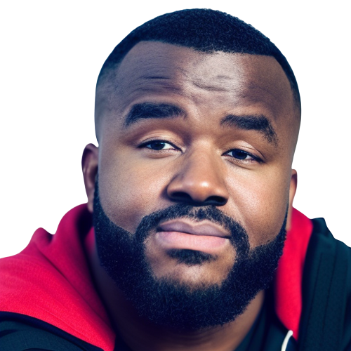

### Hi there 👋

<!--
**daviidy/daviidy** is a ✨ _special_ ✨ repository because its `README.md` (this file) appears on your GitHub profile.
-->

- 🔭 I'm a software engineer who is passionate about making open-source more accessible, creating technology to elevate people, and building community. I love working on large scale applications.
- 🌱 I focus on the Backend (70%), front-end (20%), system design, with Ruby on Rails, Laravel, Spring boot, ReactJS and Redux
- 👯 I’m looking for new opportunities

## 💬 Find me around the web 🌎: 
Twitter: [@davidyao_dev](https://twitter.com/davidyao_dev) / [LinkedIn](https://www.linkedin.com/in/nda-yao/) / [My personal website](https://david-yao.com)

- 📫 Or you can contact directly via: +1 641 451 4016
- ⚡ I love playing Soccer and BasketBall

