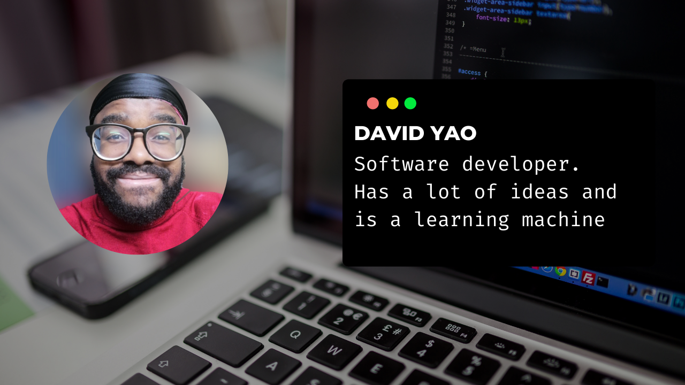

### Hi there 👋

<!--
**daviidy/daviidy** is a ✨ _special_ ✨ repository because its `README.md` (this file) appears on your GitHub profile.
-->

- 🔭 I'm a software engineer who is passionate about making open-source more accessible, creating technology to elevate people, and building community. Some technologies I enjoy working with include ReactJS, Laravel and Symfony. I help, CTOs, entrepreneurs, and companies to develop their web application with adapted packages
- 🌱 I’m currently learning Ruby on Rails at [Microverse.org](https://www.microverse.org/)
- 👯 I’m looking for new opportunities

## 💬 Find me around the web 🌎: 
Twitter: [@davidyao3](https://twitter.com/DavidYao3) / [LinkedIn](https://www.linkedin.com/in/david-yao-6bb95299/) / [My personal website](http://david-yao.com)

- 📫 Or you can contact directly via Whatsapp: +225 58450600
- ⚡ I love playing Football/Soccer and BasketBall

